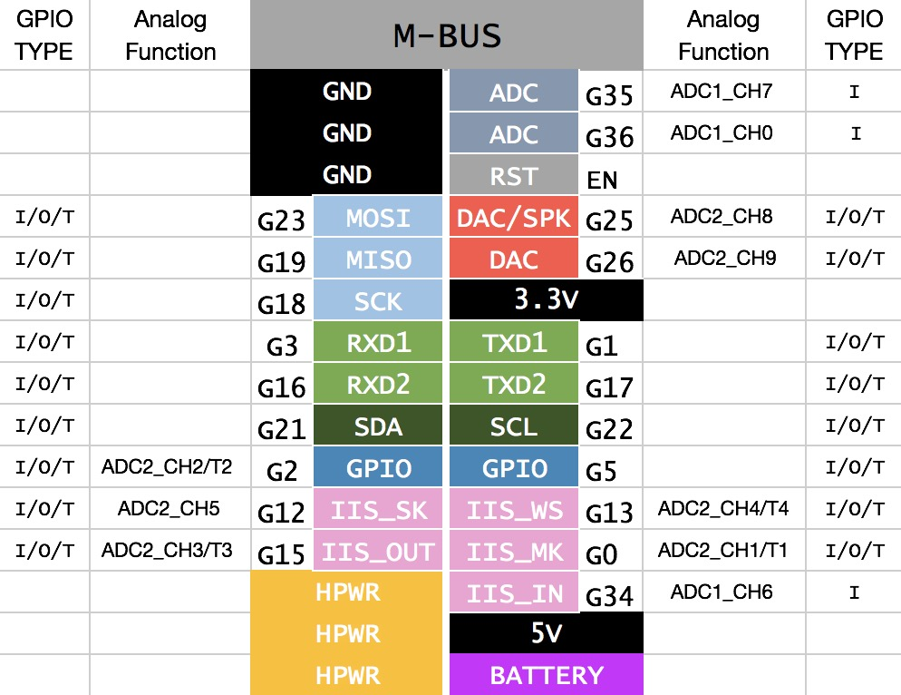

# Afantor Library

## Usage
### Installing the USB Driver
- [Download the SiLabs CP2104 Driver](https://www.silabs.com/products/development-tools/software/usb-to-uart-bridge-vcp-drivers) but 
do NOT use the Windows 10 Universal (v10.1.1) driver! If you happen to download the Universal version, you may need to manually revert to 6.7.1 
on a regular basis as Windows will repeatedly use the newer, incorrect driver after each Windows update.

(Note: If you cannot upload, please try the legacy v4 driver below. You will need to uninstall the v5 driver. And try to use a lower baudrate: 115200)
- [Download the Silabs CP210X v10 Driver Universal binary for win 10 in case of rebooting problems while flashing procedure](https://www.silabs.com/documents/public/software/CP210x_Universal_Windows_Driver.zip)
No need of reinstalling any drivers if were installed before, they should be updated "on the fly".

### Installing the ESP32 Arduino Core
- Using Arduino IDE
  + [Instructions for Windows](docs/arduino-ide/windows.md)
  + [Instructions for Mac](docs/arduino-ide/mac.md)
  + [Instructions for Debian/Ubuntu Linux](docs/arduino-ide/debian_ubuntu.md)
  + [Instructions for Fedora](docs/arduino-ide/fedora.md)
  + [Instructions for openSUSE](docs/arduino-ide/opensuse.md)
- [Using PlatformIO](docs/platformio.md)
- [Building with make](docs/make.md)
- [Using as ESP-IDF component](docs/esp-idf_component.md)

### Download Library

#### Using the Arduino IDE Library Manager

1. Choose ```Sketch``` -> ```Include Library``` -> ```Manage Libraries...```
2. Type ```Afantor``` into the search box.
3. Click the row to select the library.
4. Click the ```Install``` button to install the library.
5. Click "File-> Examples". Here are some test programs in "Afantor-Core->"

#### Using Git (most environments)
```sh
cd ~/Documents/Arduino/libraries/
git clone https://github.com/Afantor/Afantor-Core.git
```

#### Using Git (Windows)
```sh
c:
cd %USERPROFILE%\documents\libraries
git clone https://github.com/Afantor/Afantor-Core.git
```

## API
See [API](https://github.com/Afantor).

## Examples
See [examples](examples) folder.

## Hardware
[Schematic](https://github.com/Afantor/Core_SCH.pdf).

### Pinout
Peripheral|Devices | ESP32 
----------|--------|-------
ILI9341   | RST    | GPIO33 
ILI9341   | DC     | GPIO27 
ILI9341   | CS     | GPIO14
ILI9341   | MOSI   | GPIO23
ILI9341   | CLK    | GPIO18
ILI9341   | LIGHT  | GPIO32
TFCARD    | MOSI   | GPIO23
TFCARD    | MISO   | GPIO19
TFCARD    | CLK    | GPIO18
TFCARD    | CS     | GPIO5
BUTTON    | A      | GPIO39
BUTTON    | B      | GPIO39
BUTTON    | C      | GPIO39
SPEAKER   | DAC    | GPIO25
MPU6050   | SDA    | GPIO04
MPU6050   | SCL    | GPIO27

### SPI module
Peripheral Devices | ESP32 | RA-02 | Note
---------|---------|-------|---
MOSI     | GPIO23  | MOSI  | shared with TFCARD
MISO     | GPIO19  | MISO  | shared with TFCARD
SCK      | GPIO18  | SCK   | shared with TFCARD
CS       | GPIO5   | NSS   | shared with TFCARD


### M-BUS

